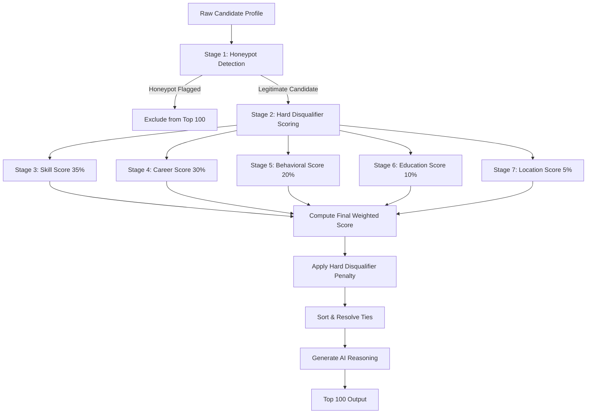

# HireSense Candidate Ranking System 🚀

HireSense is an intelligent, memory-efficient candidate ranking pipeline built for the **Redrob x Hack2Skill Hackathon**. It processes **100,000 candidate profiles** against a *Senior AI Engineer (Founding Team)* job description, filtering and selecting the top 100 candidates in under **30 seconds** on a standard CPU.

---

## 🏛️ System Architecture & 7-Stage Scoring

HireSense employs a memory-efficient streaming architecture to evaluate profiles line-by-line, keeping the peak RAM footprint under **50MB**. The ranking logic follows a comprehensive **7-Stage Pipeline**:



### 1. Stage 1: Honeypot Detection
Identifies and automatically filters out spam profiles:
- **Rule A**: Expert proficiency in 5+ skills but with `duration_months = 0` on all of them.
- **Rule B**: More than 20 skills listed but with `endorsements = 0` on all of them.

### 2. Stage 2: Hard Disqualifier Scoring
Applies critical penalties to candidates whose background does not match a startup environment:
- **Consulting Only**: Career limited entirely to large consulting/IT services (TCS, Infosys, Wipro, Accenture, Cognizant, Capgemini, HCL, Tech Mahindra) $\rightarrow$ **0.1 multiplier**.
- **No Production AI**: Career limited to academia/research and/or EdTech companies (Byju's, Unacademy, Upgrad, Vedantu) $\rightarrow$ **0.2 multiplier**.
- **Title Mismatch**: Current title in unrelated departments (Marketing, Sales, HR, Finance, Legal, Design) $\rightarrow$ **0.1 multiplier**.
- **Wrong Domain**: Skills are $80\%+$ Computer Vision/Speech/Robotics without any NLP/IR experience $\rightarrow$ **0.3 multiplier**.
- **Clean Candidate**: $\rightarrow$ **1.0 multiplier** (no penalty).

### 3. Stage 3: Skill Score (35% Weight)
Evaluates tech stack relevance:
- **Categorization**:
  - *Critical Skills* (0.15 weight each): sentence-transformers, embeddings, vector databases (FAISS, Pinecone, Qdrant, Weaviate), semantic search, retrieval, RAG.
  - *Important Skills* (0.07 weight each): Python, NLP, LLM, fine-tuning, LoRA, NDCG, recommendation systems.
  - *Bonus Skills* (0.03 weight each): learning-to-rank, XGBoost, distributed systems, open-source.
- **Proficiency Levels**: Expert (1.0), Advanced (0.8), Intermediate (0.6), Beginner (0.4).
- **Social Proof**: Logarithmic endorsement bonus (`+ 0.1 * log1p(endorsements)`) capped at 1.2 per skill. Total Stage 3 score is capped at 1.0.

### 4. Stage 4: Career Score (30% Weight)
Assesses professional trajectory:
- **Experience Years**: 5-9 years (1.0), 9-12 years (0.8), 3-5 years (0.6), else (0.3).
- **Product Company Ratio**: Ratio of career duration spent at product companies versus IT consulting.
- **Trajectory Alignment**: Scan of career history descriptions for search, retrieval, and vector keywords.
- **Title Seniority**: Matches current titles containing Engineer, Scientist, ML, AI, or NLP.

### 5. Stage 5: Behavioral Score (20% Weight)
Measures candidate engagement and trust using Redrob signals:
- Open-to-work flag (+0.3)
- Last active within 30 days (+0.3) or 90 days (+0.15)
- Short notice period (notice < 30 days $\rightarrow$ +0.2; notice > 90 days $\rightarrow$ -0.1)
- Recruiter response rate > 70% (+0.3)
- Interview completion rate > 80% (+0.2)
- High GitHub activity (+0.2)
- Verified contact info (email & phone both verified $\rightarrow$ +0.2)

### 6. Stage 6: Education Score (10% Weight)
Extracts the highest tier from the candidate's academic history:
- Tier 1 Institutions (1.0)
- Tier 2 Institutions (0.7)
- Tier 3 Institutions (0.5)
- Tier 4 / Unknown (0.3)

### 7. Stage 7: Location Score (5% Weight)
Prioritizes geographical and work-style alignment:
- India + Preferred Tech Hub (Pune, Noida, Delhi, Mumbai, Hyderabad, Bangalore, Chennai) $\rightarrow$ **1.0**
- India + Willing to Relocate $\rightarrow$ **0.8**
- India Only $\rightarrow$ **0.6**
- Outside India + Willing to Relocate $\rightarrow$ **0.4**
- Others $\rightarrow$ **0.2**

---

## ⚖️ Sorting and Tie-Breaking Rules

To ensure strict fairness and deterministic ordering:
1. Candidates are sorted primarily by **Final Score** (rounded to 4 decimal places) in descending order.
2. In the case of identical scores, the tie-breaker sorts **Candidate ID** in ascending lexicographical order (`CAND_XXXXXXX`).

---

## 🛠️ Installation & Setup

1. Ensure Python 3.11+ is installed.
2. Install the project requirements:
   ```bash
   pip install -r requirements.txt
   pip install openpyxl
   ```

---

## 💻 Complete Execution Workflow

Follow these steps sequentially to generate, validate, preview, and format the rankings.

### 1. Run the Candidate Ranker
Process the dataset and generate the validated CSV file:
```bash
python rank.py --candidates "../Data/candidates.jsonl" --out output/submission.csv
```

### 2. Validate the Output CSV
Confirm that the CSV complies with all challenge validation rules (schema, 100 rows, unique IDs/ranks, sorting):
```bash
python validate_submission.py output/submission.csv
```

### 3. Preview Rankings in the Terminal
Display a professional terminal-aligned preview showing the top 10 candidates with their scores, ranks, and wrapped reasoning, along with file stats:
```bash
python preview_results.py
```

### 4. Convert CSV to Excel (XLSX)
Convert the validated CSV file to the final Excel sheet layout:
```bash
python convert_to_xlsx.py
```

### 5. Verify the Excel Submission
Verify the converted `.xlsx` file matches the exact row requirements and column schema:
```bash
python verify_xlsx.py
```

---

## 📁 Repository Structure & Utility Scripts

* `rank.py`: The core ranking and evaluation pipeline engine.
* `validate_submission.py`: Hackathon-provided CSV validation script.
* [convert_to_xlsx.py](convert_to_xlsx.py): Conforming utility script to convert `output/submission.csv` to `output/submission.xlsx` with schemas and row counts verified.
* [preview_results.py](preview_results.py): Outputs a clean terminal interface showing dataset sizes and top 10 ranks with wrapped columns.
* [verify_xlsx.py](verify_xlsx.py): Script to ensure final Excel output is correct and ready for upload.
